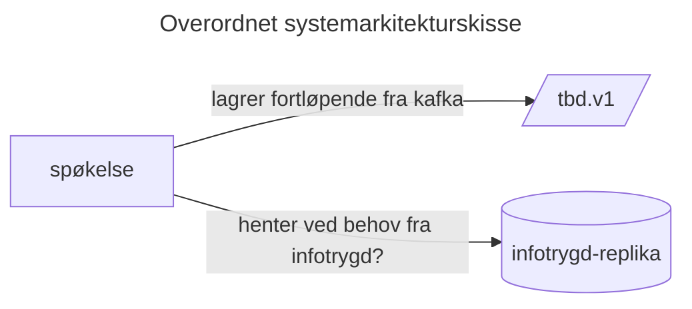

Spøkelse 
=============

~~Dette er en kafka-til-http proxy for konsumenter som ikke har anledning til å hente sykepengehistorikk over Kafka.~~

~~Den lytter på `tbd.utbetaling` og lagrer ned utbetalinger & annulleringer.~~

Dette er en intern sy-sammen-data-tjeneste som henter spleis-sykepengeperioder over kafka og infotrygd-sykepengeperioder over {protokoll her}

# Henvendelser

Spørsmål knyttet til koden eller prosjektet kan stilles som issues her på GitHub.

## For NAV-ansatte

Interne henvendelser kan sendes via Slack i kanalen #område-helse.
